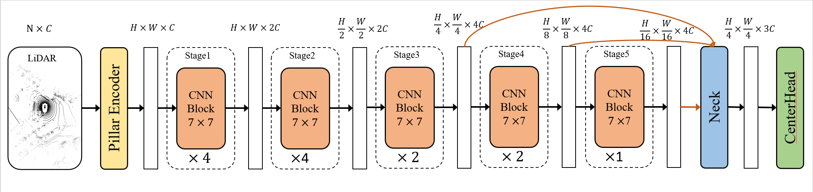
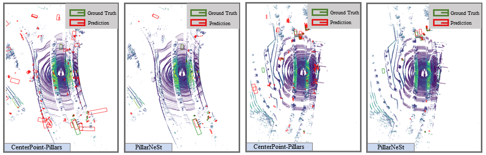
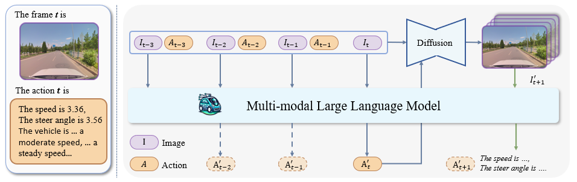

# PillarNeSt: Embracing Backbone Scaling and Pretraining for Pillar-based 3D Object Detection

[](https://ieeexplore.ieee.org/abstract/document/10495196)

<!-- [](https://arxiv.org/abs/2311.17770) -->





[PillarNeSt](https://ieeexplore.ieee.org/abstract/document/10495196) is a robust  pillar-based 3D object detectors, which obtains **66.9%**(**SOTA without TTA/model ensemble**) mAP and **71.6 %** NDS on nuScenes benchmark. 

**Visualization Results**


## News
Our paper has been officially accepted by the journal IEEE Transactions on Intelligent Vehicles (**TIV**) in April 2024.

## Preparation

* Environments
```txt
Python == 3.6
CUDA == 11.1
pytorch == 1.9.0
mmcls == 0.22.1
mmcv-full == 1.4.2
mmdet == 2.20.0
mmsegmentation == 0.20.2
mmdet3d == 0.18.1
```

* Data   
Follow the [mmdet3d](https://github.com/open-mmlab/mmdetection3d/blob/master/docs/en/data_preparation.md) to process the nuScenes dataset.

- Weights

Model weights are available at [Google Drive](https://drive.google.com/drive/folders/13GyGPlq_Z7ma_KOKmkhPLMhMKsMo43cE?usp=sharing) and [BaiduWangpan](https://pan.baidu.com/s/1Ev1pXbST_XWEyD8CTVN2JQ?pwd=1111)(PW: 1111).

## Main Results
Results on nuScenes **val set**. (15e + 5e means the last 5 epochs should be trained without GTsample)

|      Config      |  mAP  |  NDS  | Schedule |                           weights                            | weights    |
| :--------------: | :---: | :---: | :------: | :----------------------------------------------------------: | ---------- |
| PillarNeSt-Tiny  | 58.8% | 65.6% |  15e+5e  | [Google Drive](https://drive.google.com/file/d/1LQ5kwCEUnCBVE7meObAwkVM2kbzfnYGC/view?usp=drive_link) | [Baidu](https://pan.baidu.com/s/1UosqfU651jPzkL1ck5E9Sw?pwd=1111) |
| PillarNeSt-Small | 61.7% | 68.1% |  15e+5e  | [Google Drive](https://drive.google.com/file/d/1EuGImxN_gM63Y9BUGfOjSqZwvB71v29A/view?usp=drive_link) | [Baidu](https://pan.baidu.com/s/1dvnoF3nHohsu2bIOJT33lw?pwd=1111) |
| PillarNeSt-Base  | 63.2% | 69.2% |  15e+5e  | [Google Drive](https://drive.google.com/file/d/1IgJXF-modx_VHru3WJpTp6-6sTpvexz_/view?usp=drive_link) | [Baidu](https://pan.baidu.com/s/1EJsJ_2XoE5U8N2Zf3f_QrQ?pwd=1111) |
| PillarNeSt-Large | 64.3% | 70.4% |  18e+2e  | [Google Drive](https://drive.google.com/file/d/1DBFfWKevf5Wz3z2eBPd4ww3NpVuwN7Be/view?usp=drive_link) | [Baidu](https://pan.baidu.com/s/1qyoJdDGnylxsyoSYCSQBnQ?pwd=1111) |


Results on nuScenes **test set** (without any TTA/model ensemble). 

|      Config      |  mAP   |  NDS  |
| :--------------: | :----: | :---: |
| PillarNeSt-Base  | 65.6 % | 71.3% |
| PillarNeSt-Large | 66.9%  | 71.6% |

---
Update:
- [x] Update new CenterPointBBoxCoder
- [x] add visualization
- [x] add CenterPlusHead
- [x] add HeightPillarFeatureNet
- [x] add CenterPoint-Plus
- [x] Small, Base, Large configs
- [x] Upload weights to Baidu cloud
- [x] Backbone code


## Contact

If you have any questions, feel free to open an issue or contact us at maoweixin@megvii.com (maowx2017@fuji.waseda.jp) or wangtiancai@megvii.com.

## Citation
If you find PillarNeSt helpful in your research, please consider citing: 
```bibtex   
@ARTICLE{10495196,
  author={Mao, Weixin and Wang, Tiancai and Zhang, Diankun and Yan, Junjie and Yoshie, Osamu},
  journal={IEEE Transactions on Intelligent Vehicles}, 
  title={PillarNeSt: Embracing Backbone Scaling and Pretraining for Pillar-based 3D Object Detection}, 
  year={2024},
  volume={},
  number={},
  pages={1-10},
  keywords={Three-dimensional displays;Point cloud compression;Feature extraction;Detectors;Object detection;Task analysis;Convolution;Point Cloud;3D Object Detection;Backbone Scaling;Pretraining;Autonomous Driving},
  doi={10.1109/TIV.2024.3386576}}
```

---

#### PS:

Recently, our team also conduct some explorations into the application of multi-modal large language model (**MLLM**) in the field of autonomous driving:

 [Adriver-I: A general world model for autonomous driving](https://arxiv.org/abs/2311.13549)

 

```
@article{jia2023adriver,
  title={Adriver-i: A general world model for autonomous driving},
  author={Jia, Fan and Mao, Weixin and Liu, Yingfei and Zhao, Yucheng and Wen, Yuqing and Zhang, Chi and Zhang, Xiangyu and Wang, Tiancai},
  journal={arXiv preprint arXiv:2311.13549},
  year={2023}
}
```

#### PPS:

组内招收具身智能相关的实习生，详情咨询/简历投递：maoweixin@megvii.com
